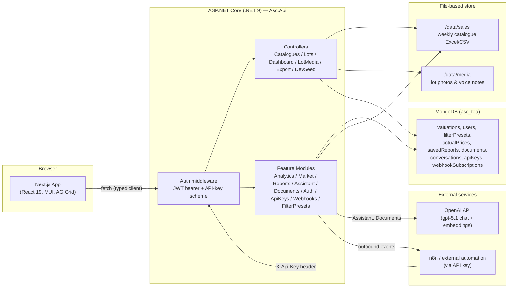
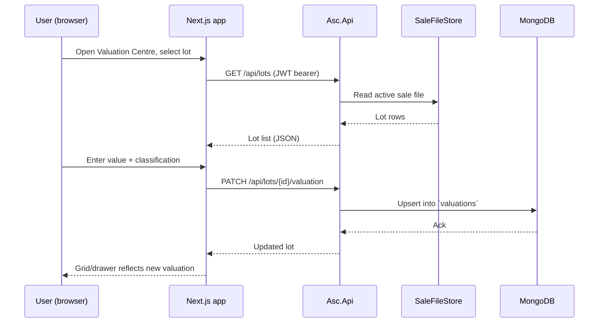

# 01 — System Architecture

## Purpose
Describe the real, current shape of the system — frontend, backend, data stores, and how they connect — as the reference every other architecture doc (22, 23, 24) builds on.

## Scope
System-level architecture: processes, data stores, and the boundaries between them. Not component-level frontend structure (see [22_Frontend_Architecture.md](22_Frontend_Architecture.md)) or endpoint-level API design (see [24_API_Guidelines.md](24_API_Guidelines.md)).

## Responsibilities
- Show how a request flows from browser to data and back.
- Record which data lives where, and why.
- Set the boundary rules future changes must respect (e.g. "catalogue data is file-based, not Mongo").

## Architecture

### High-level component diagram

### Request flow — valuing a lot

## UI behaviour
Not applicable at system level — see [03_Dashboard_Experience.md](03_Dashboard_Experience.md) and module docs.

## Business rules

### Frontend
Next.js 16 (App Router), React 19, TypeScript. Talks to the API only through a typed fetch client (`frontend/src/lib/api.ts`). No direct database access from the client, ever.

### Backend
ASP.NET Core (.NET 9) Web API, `backend/Asc.Api`. Two organisational layers:
- **Controllers** (`Controllers/`) — the original, catalogue/lot/dashboard/media/export/dev-seed surface.
- **Modules** (`Modules/`) — newer, self-contained feature modules (Analytics, Market, Reports, Assistant, Documents, Auth, ApiKeys, Webhooks, FilterPresets), each under its own `api/v1/...` route prefix.

New backend features should default to the **Modules** pattern — see [23_Backend_Architecture.md](23_Backend_Architecture.md).

### MongoDB overlays
MongoDB (`asc_tea` database, `ConnectionStrings:Mongo`, defaults to `mongodb://localhost:27017`) stores only **user-entered or system state** that has no natural file representation: valuations, users, filter presets, actual (post-sale) prices, saved reports, uploaded documents and their embedded chunks, AI assistant conversations, API keys, and webhook subscriptions. Two legacy collections (`catalogues`, `lots`) exist solely to support a purge endpoint from an earlier design and are not part of the current data model.

### File-based catalogues
Catalogue and lot data itself is **not** stored in MongoDB. It's read directly from weekly sale Excel/CSV files under `/data/sales` via `SaleFileStore` / `ICatalogueSource`, warmed into memory at API startup by a hosted service. Per-lot photos and voice notes are similarly disk-backed, under `/data/media`, via `LotMediaStore`. This is a deliberate choice for low operational friction — no import/migration step, the source file is the source of truth for lot data, and valuations/notes are layered on top from Mongo by lot key. **This whole file-based layer is temporary testing infrastructure**, expected to be replaced by a database pull (remote API) — don't over-engineer against it.

Sales are year-wise: files sitting flat in `/data/sales` (`NN.xlsx`, no year folder) are the legacy 2026 namespace, whose catalogue/lot ids are frozen — they're already referenced by stored valuations/reports and must never be recomputed. Any other year lives under `/data/sales/{year}/` and gets year folded into its id hash from the start (two small, deliberately-unmerged code paths inside `SaleFileStore`, not one scheme forced to stay backward-compatible forever). The gzip parse cache and in-memory LRU are keyed by `(year, saleNo)` accordingly.

### Caching
Sale files are warmed into memory at startup (`SaleFileStore`) rather than re-read per request. No distributed cache layer exists yet — see [19_Performance.md](19_Performance.md) for where one would matter (large catalogue exports, repeated analytics aggregations).

### Authentication
Real JWT bearer auth (`AuthController`, ASP.NET's `PasswordHasher<AppUser>`, roles via `ClaimTypes.Role`), plus a parallel API-key scheme (`ApiKeyAuthenticationHandler`) selected by a policy scheme reading the `X-Api-Key` header, intended for external automation (n8n). Login is rate-limited (10/min/IP). See [18_Security.md](18_Security.md) for the full policy.

### Analytics
`Modules/Analytics` (`api/v1/analytics`) computes overview/breakdown/distribution/broker/top-bottom/quality aggregations over the active sale's lots + valuations. This is the closest existing thing to the "shared analytics engine" described in [06_Shared_Analytics_Engine.md](06_Shared_Analytics_Engine.md) — that document specifies how it should evolve into a formally reusable engine consumed by every module, not just the Analysis page.

### AI
`Modules/Assistant` (`api/v1/assistant`) — OpenAI (`gpt-5.1`)-backed chat with read-only tool-calling grounded in catalogue data. `Modules/Documents` (`api/v1/documents`) — OpenAI-embeddings-backed knowledge base upload/search. Both require an `OpenAI:ApiKey` user secret; the rest of the platform functions without one.

### Reports
`Modules/Reports` (`api/v1/reports`) — report types, Excel export, saved reports (persisted to Mongo's `savedReports`).

### Exports
`ExportController` (`api/export/excel`) — ad hoc Excel export of an arbitrary lot selection, distinct from the Reports module's fixed report types.

### Future scalability
The root README already flags the two known scaling seams: (1) AG Grid currently loads up to 5,000 rows client-side per catalogue — a server-side row model/datasource is needed for 100k+-row catalogues; (2) MongoDB was chosen for local-dev friction, not scale — a move to Postgres/EF Core is scoped to `backend/Asc.Api/Data` and the controllers if ever needed. Neither is scheduled; both are noted here so a future contributor doesn't need to rediscover them.

## Dependencies
Read before: [22_Frontend_Architecture.md](22_Frontend_Architecture.md), [23_Backend_Architecture.md](23_Backend_Architecture.md), [24_API_Guidelines.md](24_API_Guidelines.md), [18_Security.md](18_Security.md).

## Future expansion
See [27_Future_Roadmap.md](27_Future_Roadmap.md) for product-level future capabilities; see "Future scalability" above for infrastructure-level ones.

## Implementation notes
The root [`README.md`](../README.md) contains the concrete local run instructions (MongoDB service, JWT/OpenAI user secrets, `npm run dev`). Its "what's a placeholder" section was stale as of this writing — it described several now-live modules as "coming soon" and claimed legacy endpoints were deliberately left unauthenticated, neither of which was true by the time this was verified against source (see [18_Security.md](18_Security.md)). It has since been corrected to point at `/docs` as the maintained reference. Keep it that way: update the root README's summary alongside any future architecture change, rather than letting it drift again.

## Open questions
- No formal API versioning policy beyond `api/v1/...` on newer modules vs. unversioned `api/...` on the original controllers — should the original controllers be migrated under `v1` for consistency?
- No distributed cache or background job runner exists yet; whether one is needed depends on real catalogue sizes in production, which aren't documented anywhere yet.

## Best practices
- Never write catalogue/lot data to MongoDB — it belongs in the file store. Only user-entered state belongs in Mongo.
- Never call MongoDB or the file store directly from the frontend — always through the API.
- When adding a backend feature, prefer a new module under `Modules/` with its own `api/v1/...` prefix over adding to the legacy `Controllers/` surface.
