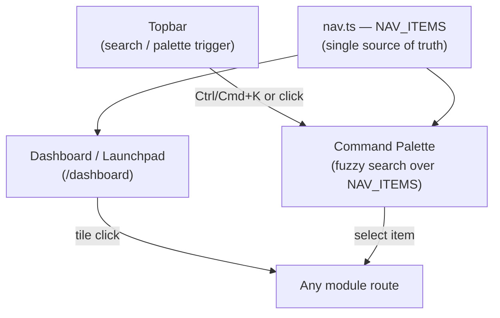

# 04 — Navigation Architecture

## Purpose
Document the platform's sidebar-free, launchpad-and-command-palette navigation model so it isn't accidentally reverted to a conventional sidebar by a future contributor unfamiliar with the redesign.

## Scope
Top-level navigation only: the launchpad, the command palette, the topbar, and route structure. Per-module internal navigation (tabs within a report, filters within the catalogue grid) belongs to that module's own doc.

## Responsibilities
- Define how a user gets from anywhere to any module.
- Own the canonical module list (`NAV_ITEMS`) and its metadata.
- Set the rule that new modules must be added here, not just wired as an orphan route.

## Architecture
`frontend/src/components/shell/Shell.tsx` renders a single `Topbar` plus page content — no persistent side navigation. `frontend/src/components/shell/nav.ts` is the single source of truth for the module list (`NAV_ITEMS`) and section grouping (`NAV_SECTIONS`), consumed by both the launchpad tile grid and the command palette. `frontend/src/components/shell/CommandPalette.tsx` implements the palette.

## UI behaviour

### Dashboard-first navigation
There is no traditional home page distinct from the dashboard — `/` redirects straight to `/dashboard`, which doubles as the module launchpad (via `ModuleTile`s) and the KPI home base. See [03_Dashboard_Experience.md](03_Dashboard_Experience.md) for the KPI/widget side of that page; this document covers only its role as a navigation surface.

### No permanent sidebar
Deliberately removed (commit `f85b306`). `Shell.tsx` carries an explicit comment that navigation between modules "now happens via the launchpad home page's tile grid or the command palette." Do not reintroduce a persistent side rail without revisiting this decision explicitly — it was a considered redesign, not an oversight.

### Visual module tiles
Each entry in `NAV_ITEMS` renders as a `ModuleTile`: icon, one of eight brand-gradient overlay treatments (hand-picked per module so neighbours never look identical), optional verified photography, label, and one-line description. Grouped by `section` (`Workspace`, `Intelligence`, `Library`, `System`).

### Global search / command palette
`Ctrl/Cmd+K` (or clicking the Topbar search field) opens `CommandPalette`, which fuzzy-searches over the same `NAV_ITEMS` list — label and description both searchable. This is the fast path for anyone who knows where they're going; the tile grid is the discoverable path for anyone who doesn't.

### Breadcrumbs
Not implemented — routes are flat (one level under `(app)/`), so breadcrumb navigation hasn't been needed. If a module grows nested sub-routes, revisit this.

### Floating navigation
Not implemented and not currently needed given the flat route structure.

### Keyboard shortcuts
`Ctrl/Cmd+K` for the command palette is the only documented global shortcut today. Module-specific shortcuts (if any) belong in that module's own doc.

### Navigation hierarchy
Flat: `Topbar` (always visible) → `Dashboard/Launchpad` or `CommandPalette` → any of the 16 module routes (`dashboard`, `catalogue`, `valuation`, `worksheet`, `analysis`, `reports`, `broker`, `market`, `knowledge`, `assistant`, `saved-filters`, `saved-reports`, `data-import`, `exports`, `settings`, `help`), grouped into four sections:

| Section | Modules |
|---|---|
| Workspace | Dashboard, Catalogue Manager, Valuation Centre |
| Intelligence | Knowledge Base, AI Assistant, Analysis, Reports, Broker Comparison, Market Intelligence |
| Library | Saved Reports, Saved Filters, Data Import, Exports |
| System | Settings, Help |

## Business rules
- Every route reachable in the app must have a corresponding `NAV_ITEMS` entry — no orphan pages reachable only by typing a URL. This keeps the command palette and launchpad exhaustive.
- `status` on a nav item must reflect reality (`"live"` vs `"soon"`). A module marked `"live"` that isn't fully working is worse than one honestly marked `"soon"` — this was the exact problem with the root README's stale "coming soon" list (see [01_System_Architecture.md](01_System_Architecture.md)).

## Dependencies
[03_Dashboard_Experience.md](03_Dashboard_Experience.md), [02_UI_UX_Design_System.md](02_UI_UX_Design_System.md) (tile visual treatment), each module doc (09–17) for the `NAV_ITEMS` entry it owns.

## Future expansion
Nested breadcrumbs if any module grows sub-routes; a "recently visited" or "pinned modules" affordance in the palette; keyboard shortcuts beyond the palette trigger.

## Implementation notes
Add a module by: (1) creating the route under `frontend/src/app/(app)/`, (2) adding an entry to `NAV_ITEMS` in `nav.ts` with an accurate `status`, (3) adding the corresponding numbered doc under `/docs` following the 09–17 template, (4) linking it from this table and from [05_Business_Intelligence.md](05_Business_Intelligence.md) if it's an intelligence module.

## Open questions
- Should the command palette also support in-app actions (e.g. "create new report") beyond navigation? Not implemented today — currently navigation-only.

## Best practices
- Never wire a route without a `NAV_ITEMS` entry.
- Never mark a nav item `"live"` before the feature actually works end-to-end.
