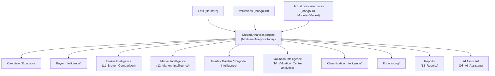

# 05 — Business Intelligence

## Purpose
Define the "Intelligence" section of the platform as a coherent whole — what each analytical module answers, and how they relate — so new BI features are added to the right module instead of scattered.

## Scope
The Intelligence-section modules: Analysis, Reports, Broker Comparison, Market Intelligence, and the AI Assistant/Knowledge Base as consumers of BI data. Detailed per-module behaviour lives in each module's own doc (11–13, 08, 15); this document is the map between them.

## Responsibilities
- Describe what question each Intelligence module answers.
- Ensure every Intelligence module consumes the shared analytics engine and metrics registry rather than computing independently.
- Own the cross-module filter/AI-integration story.

## Architecture
All Intelligence modules read from the same two sources: the active sale's lots (file-based, via `SaleFileStore`) and their valuations (MongoDB). They should route business calculations through `Modules/Analytics` today, evolving toward the formal [06_Shared_Analytics_Engine.md](06_Shared_Analytics_Engine.md) / [07_Metrics_Registry.md](07_Metrics_Registry.md) design.

`*` marked modules describe an analytical *lens* the shared engine should support, not necessarily a dedicated route today — cross-check against `frontend/src/app/(app)/analysis/` and `Modules/Analytics` before assuming a standalone page exists.

## UI behaviour

### Business Intelligence Center
There is no single "BI Center" route distinct from the individual modules — the Intelligence *section* of the launchpad (see [04_Navigation_Architecture.md](04_Navigation_Architecture.md)) is the de facto center. Don't build a redundant aggregator page; the launchpad section already serves that purpose.

### Overview / executive analytics
Delivered via the Dashboard's KPI panel ([03_Dashboard_Experience.md](03_Dashboard_Experience.md)) and the Reports module's executive report type ([13_Reports.md](13_Reports.md)), not a separate page.

### Buyer Intelligence
Not currently a dedicated module or route. Broker Comparison ([11_Broker_Comparison.md](11_Broker_Comparison.md)) is the closest existing analogue (rankings, market share by broker). A true buyer-side (as opposed to broker-side) lens is a future-expansion item — see [27_Future_Roadmap.md](27_Future_Roadmap.md) ("Customer Intelligence").

### Broker Intelligence
See [11_Broker_Comparison.md](11_Broker_Comparison.md) — rankings, market share, average valuation across brokers, backed by `Modules/Analytics`.

### Market Intelligence
See [12_Market_Intelligence.md](12_Market_Intelligence.md) — estimate vs. actual auction price comparison, backed by `Modules/Market`.

### Grade / Garden / Regional Intelligence
Delivered today through the Analysis page's breakdown/distribution views (`Modules/Analytics` — breakdown, distribution, top-bottom, quality endpoints), filterable by grade/garden, rather than as separate dedicated routes. Treat "grade intelligence" etc. as filter lenses on Analysis, not standalone modules, unless product direction changes.

### Valuation Intelligence
Completion percentage, valuation distribution, and classification mix are computed from the same lots+valuations join used everywhere else — see [10_Valuation_Centre.md](10_Valuation_Centre.md) for the data-entry side and this document's Analysis coverage for the analytical side.

### Classification Intelligence
Best/Below Best/Poor classification breakdowns — part of Analysis's quality endpoint (`Modules/Analytics`), not a separate module.

### Forecasting
Not implemented. Explicitly future-facing — see [27_Future_Roadmap.md](27_Future_Roadmap.md) ("Advanced forecasting", "Forecast Accuracy" as an example future metric in [07_Metrics_Registry.md](07_Metrics_Registry.md)).

### Custom analysis
No user-defined/ad hoc analysis builder exists today. Saved Filters ([09_Catalogue_Manager.md](09_Catalogue_Manager.md)) is the closest thing — named filter sets on the Catalogue Manager grid, not a BI query builder.

### Charts
Charting is implemented per-module (Analysis breakdowns, Broker Comparison rankings, Market Intelligence comparisons) rather than through a shared charting component library today — see [20_Component_Library.md](20_Component_Library.md) for where a shared chart component should be extracted to if duplication grows.

### Reports
See [13_Reports.md](13_Reports.md).

### Filters
Catalogue-grid filters (AG Grid Enterprise side panel) are distinct from Analysis-page filters (grade/garden/broker breakdowns). Saved Filters persist the former, not the latter, today.

### AI integration
The AI Assistant ([08_AI_Assistant.md](08_AI_Assistant.md)) answers questions by tool-calling into the same underlying data these Intelligence modules use — it should be thought of as a natural-language front end onto the shared analytics engine, not a separate data path. Any metric the Assistant can report must ultimately trace to the same registry entry as the equivalent dashboard/report number ([07_Metrics_Registry.md](07_Metrics_Registry.md)).

## Business rules
- No Intelligence module may compute a metric with logic duplicated from another module — route through `Modules/Analytics` (today) / the metrics registry (target state).
- A number shown in two different Intelligence modules for the same sale must match exactly, or it's a bug.

## Dependencies
[06_Shared_Analytics_Engine.md](06_Shared_Analytics_Engine.md), [07_Metrics_Registry.md](07_Metrics_Registry.md), [08_AI_Assistant.md](08_AI_Assistant.md), [10_Valuation_Centre.md](10_Valuation_Centre.md), [11_Broker_Comparison.md](11_Broker_Comparison.md), [12_Market_Intelligence.md](12_Market_Intelligence.md), [13_Reports.md](13_Reports.md).

## Future expansion
Buyer/Customer Intelligence, dedicated Grade/Garden/Regional Intelligence routes if the Analysis page's filter-lens approach stops scaling, Forecasting, a custom-analysis/query-builder UI. See [27_Future_Roadmap.md](27_Future_Roadmap.md).

## Implementation notes
Primary backend surface: `Modules/Analytics` (`api/v1/analytics/overview|breakdown|distribution|brokers|top-bottom|quality`), `Modules/Market` (`api/v1/market/*`), `Modules/Reports` (`api/v1/reports/*`).

## Open questions
- Should Grade/Garden/Regional views graduate from Analysis filter-lenses into dedicated routes as usage grows? No decision recorded.

## Best practices
Before adding a new "Intelligence" capability, check whether it's really a new filter lens on Analysis, a new Reports report type, or a genuinely new module — most requests turn out to be the first two.
