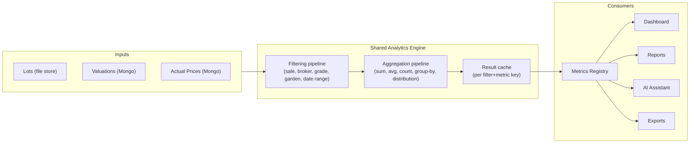

# 06 — Shared Analytics Engine

## Purpose
Specify a single, reusable analytics engine so that every dashboard widget, report, AI answer, and export computes numbers the same way — the "one number, one source" principle from [00_Project_Vision.md](00_Project_Vision.md).

## Scope
The calculation layer between raw data (lots, valuations, actual prices) and every consumer of aggregated numbers. Not the presentation of those numbers (dashboards, reports, charts — see their respective docs) and not the catalogue of *which* metrics exist (see [07_Metrics_Registry.md](07_Metrics_Registry.md), which sits on top of this engine).

## Responsibilities
- Own aggregation and filtering logic over lots + valuations + actual prices.
- Guarantee identical results for identical inputs regardless of caller (dashboard vs. report vs. AI Assistant vs. export).
- Provide the substrate the Metrics Registry ([07_Metrics_Registry.md](07_Metrics_Registry.md)) registers named metrics against.

## Architecture
Today, this responsibility is carried by `Modules/Analytics` (`backend/Asc.Api/Modules/Analytics`, routes under `api/v1/analytics`) plus `Modules/Market` for actual-price comparisons. This document specifies the target shape that logic should be refactored toward as more consumers (Reports, AI Assistant, Exports) need the same aggregations, rather than each reimplementing its own query.

## UI behaviour
Not applicable — this is a backend/service-layer concern with no direct UI.

## Business rules

### Responsibilities (detail)
The engine's job stops at "produce a correct, well-typed aggregate result for a given filter set." Formatting (currency display, chart rendering), metric naming, and caching *policy* (TTL, invalidation trigger) belong to the Metrics Registry layer above it.

### Reusable services
Filtering (by sale/catalogue, broker, grade, garden, classification, date range) and aggregation (sum, average, count, group-by, distribution/percentile) should each be a composable, independently testable service — not duplicated per-endpoint logic as currently exists across `Modules/Analytics`'s several endpoints (overview/breakdown/distribution/brokers/top-bottom/quality).

### Aggregation pipeline
Given a filter set, produce grouped aggregates (e.g. average valuation by broker, count by grade, distribution buckets). Should be data-source-agnostic at the interface level even though today's only real inputs are the file-based lot store and Mongo-backed valuations/actual prices.

### Filtering pipeline
A single, shared filter representation (sale ID, broker, grade, garden, classification, date range) used identically whether the caller is the Analysis page, a saved report, or an AI Assistant tool call. Today, filter shapes are likely defined per-endpoint in `Modules/Analytics` — consolidating them is the concrete first refactor this document recommends.

### Caching strategy
No dedicated caching layer exists yet beyond `SaleFileStore`'s startup warm of raw sale files (see [01_System_Architecture.md](01_System_Architecture.md)). As Reports, AI Assistant tool-calling, and Exports all start requesting the same aggregates repeatedly per sale, a per-filter+metric result cache (in-process, keyed by a hash of the filter set) becomes worth adding — see [19_Performance.md](19_Performance.md).

### Performance
Aggregation currently runs against in-memory lot data (already warmed by `SaleFileStore`) joined with Mongo valuations — acceptable at current catalogue sizes (~5,000 rows, matching the AG Grid client-side row limit noted in [01_System_Architecture.md](01_System_Architecture.md)). Revisit if catalogue sizes grow past that, in tandem with the AG Grid server-side row model work already flagged there.

### Concurrency
No known concurrency hazards today — aggregation is read-only over data other requests may be concurrently writing to (valuations). Reads should tolerate eventually-consistent results (a valuation saved mid-aggregation may or may not be reflected) rather than requiring locking; this matches the low-stakes nature of dashboard/report numbers being "close to real-time," not transactionally exact.

### Future extensibility
New data sources (e.g. forecasting model outputs, buyer-side data if [27_Future_Roadmap.md](27_Future_Roadmap.md) items land) should be addable as new inputs to the same filtering/aggregation pipeline, not as parallel bespoke aggregation code.

Every dashboard and report must consume this engine — direct database or file-store aggregation queries written inside a controller, a report generator, or an AI tool handler are a code smell once this engine exists, and should be refactored to call it instead.

## Dependencies
[07_Metrics_Registry.md](07_Metrics_Registry.md) (built on top of this), [05_Business_Intelligence.md](05_Business_Intelligence.md), [23_Backend_Architecture.md](23_Backend_Architecture.md), [19_Performance.md](19_Performance.md).

## Future expansion
Formal extraction of `Modules/Analytics`'s shared logic into a standalone service layer consumable by `Modules/Reports`, `Modules/Assistant`, and `ExportController` without those modules calling `Modules/Analytics`'s HTTP endpoints internally (i.e., a shared class library, not cross-module HTTP calls).

## Implementation notes
Current real implementation: `backend/Asc.Api/Modules/Analytics`. Treat this document's "Engine" as the target refactor of that module, not a separate thing that already exists alongside it.

## Open questions
- Should the engine be a synchronous in-process service, or should heavy aggregations move to a background job with cached results, once catalogue sizes grow? Not decided.
- Result cache invalidation trigger (on every valuation write? time-based TTL?) is undecided.

## Best practices
- Before writing a new aggregation query anywhere in the backend, check whether `Modules/Analytics` already computes it (or a close variant) and extend/reuse rather than duplicate.
- Any new metric-shaped calculation should be registered via [07_Metrics_Registry.md](07_Metrics_Registry.md) rather than inlined in a controller.
