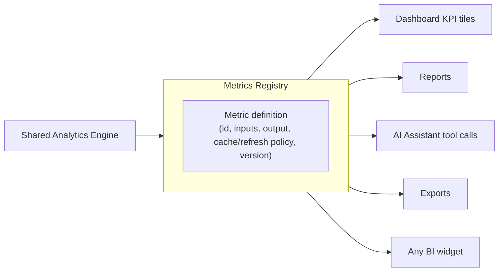

# 07 — Metrics Registry

## Purpose
Specify a single registry of named, versioned metric definitions so business logic (e.g. "what counts as a valued lot," "how is buyer market share calculated") is defined exactly once and consumed everywhere, instead of being reimplemented slightly differently in the dashboard, a report, and an AI Assistant answer.

## Scope
The catalogue of *what metrics exist and what they mean*, sitting on top of [06_Shared_Analytics_Engine.md](06_Shared_Analytics_Engine.md) (which provides the *how to compute* substrate). This document does not define the aggregation/filtering mechanics themselves.

## Responsibilities
- Give every metric a stable identifier, inputs, output shape, and owner definition.
- Prevent duplicated business logic for the same conceptual metric.
- Make it possible to answer "which surfaces use metric X" for impact analysis before changing its definition.

## Architecture
Target design: a registry (initially a well-organised backend module, e.g. `Modules/Metrics`, not yet implemented) mapping a metric identifier to a definition that the [Shared Analytics Engine](06_Shared_Analytics_Engine.md) can execute. Every BI widget, AI response, report, and export requests metrics **by identifier**, never by reimplementing the calculation inline.



## UI behaviour
Not applicable — backend/service-layer concern. UI consumers (dashboard tiles, report tables, AI answers) render whatever value+format the registry entry returns; they must not reformat or recompute it themselves beyond display formatting (currency symbol, decimal places).

## Business rules

### Metric identifiers
Stable, human-readable, namespaced strings, e.g. `valuation.average`, `buyer.market_share`, `broker.performance_score`, `lots.completion_percentage`, `grade.top_n`, `garden.top_n`, `forecast.accuracy`. Once published, an identifier's *meaning* must not change without a version bump (see Versioning below) — callers depending on it should never silently get a differently-defined number.

### Dependencies (per metric)
Each definition declares which raw inputs it reads (lots, valuations, actual prices, etc.) and which other metrics (if any) it composes. This makes it possible to trace, for a given number shown on screen, exactly which underlying data produced it — important for trust when a taster or manager questions a figure.

### Inputs / Outputs
Inputs: a filter set (sale, broker, grade, garden, classification, date range — the same shared filter shape from [06_Shared_Analytics_Engine.md](06_Shared_Analytics_Engine.md)). Output: a typed value (number, distribution, ranked list) plus metadata (as-of timestamp, filter set echoed back, confidence/completeness indicator where relevant, e.g. "62% of lots valued" alongside an average valuation computed only over valued lots).

### Caching
Each metric declares its own cache policy (e.g. "recompute on every request," "cache 60s," "cache until next valuation write for this sale") rather than one global policy — an executive KPI tolerates more staleness than a live valuation-completion counter.

### Refresh strategy
Metrics whose inputs change frequently (completion %, average valuation during active valuation work) should support cheap incremental refresh; metrics over largely static post-sale data (market accuracy after a sale closes) can be computed once and cached longer.

### Versioning
A metric's *definition* (formula) is versioned. Changing what "average valuation" means (e.g. including vs. excluding withdrawn lots) should introduce a new version or a clearly renamed identifier, not silently redefine the existing one out from under existing reports/dashboards.

### Documentation
Every registered metric must have a one-line human description alongside its formula — this is what the AI Assistant should surface when asked "how is X calculated," and what a report footnote can reference.

### Example metrics
| Identifier | Description | Primary inputs |
|---|---|---|
| `valuation.average` | Mean valuation across valued lots in the filter set | lots, valuations |
| `buyer.market_share` | Share of lots/value won by buyer, within filter set | lots, valuations, actual prices |
| `broker.performance` | Broker ranking by average valuation / market share | lots, valuations |
| `lots.completion_percentage` | % of lots in the filter set that have a saved valuation | lots, valuations |
| `grade.top_n` | Top N grades by count or average valuation | lots, valuations |
| `garden.top_n` | Top N gardens by count or average valuation | lots, valuations |
| `forecast.accuracy` | Estimate vs. actual price accuracy (future — see [27_Future_Roadmap.md](27_Future_Roadmap.md)) | valuations, actual prices |

### Example: registering and consuming a new metric
Illustrative shape (not a committed API — the registry itself doesn't exist yet):
```csharp
// Registration (Modules/Metrics, target design)
MetricRegistry.Register(new MetricDefinition(
    id: "broker.performance",
    description: "Average valuation and market share ranking by broker",
    inputs: new[] { Input.Lots, Input.Valuations },
    compute: (filters, engine) => engine.GroupBy(filters, GroupKey.Broker)
        .Select(g => new BrokerPerformance(g.Key, g.AverageValuation(), g.MarketShare())),
    cachePolicy: CachePolicy.InvalidateOnValuationWrite
));

// Consumption — identical call from a dashboard tile, a report, or an AI tool handler
var result = await metricsRegistry.Get("broker.performance", filters);
```
The point of the example is that **the calculation is written once**, in the registration, and every consumer above only ever calls `Get(id, filters)`.

## Dependencies
[06_Shared_Analytics_Engine.md](06_Shared_Analytics_Engine.md) (the engine this registry executes against), [05_Business_Intelligence.md](05_Business_Intelligence.md), [08_AI_Assistant.md](08_AI_Assistant.md) (a primary consumer), [13_Reports.md](13_Reports.md), [16_Exports.md](16_Exports.md).

## Future expansion
Forecast-accuracy metrics once forecasting exists; buyer-side metrics once buyer intelligence exists (see [27_Future_Roadmap.md](27_Future_Roadmap.md)).

## Implementation notes
Not yet implemented as a distinct module — today, each consumer (`Modules/Analytics`, `Modules/Reports`, `Modules/Assistant`) computes its own numbers directly. This document specifies the target state; the first concrete step toward it is consolidating `Modules/Analytics`'s existing aggregations behind named identifiers before wiring Reports and the Assistant to call them instead of their own logic.

## Open questions
- Where should the registry physically live — a new `Modules/Metrics`, or inside the analytics engine module itself? Not decided.
- Should metric definitions be data (a config/JSON catalogue) or code (as sketched above)? Code is likely right given they involve real computation, but worth confirming before implementation.

## Best practices
- Never compute a "known" metric (one that already has, or obviously should have, a registry identifier) with fresh inline logic in a new feature — register it once, reuse everywhere.
- When in doubt whether a calculation is a "metric," ask: would a dashboard tile, a report, and an AI answer all plausibly want this exact number? If yes, it belongs in the registry.
