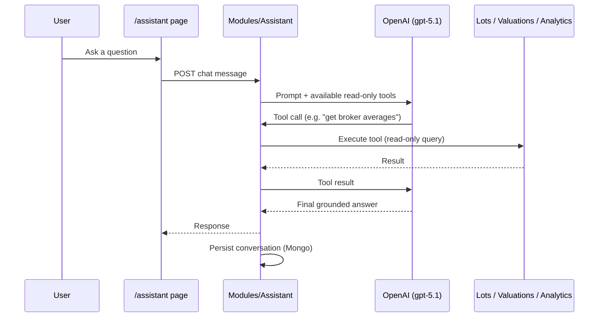

# 08 — AI Assistant

## Purpose
Define what the AI Assistant is for, how it's grounded, and its limits, so it stays a trustworthy, data-grounded tool rather than drifting into unconstrained generation.

## Scope
The `/assistant` route and `Modules/Assistant` backend module. Not the Knowledge Base's document search (see [15_Knowledge_Base.md](15_Knowledge_Base.md)), though the two share the OpenAI dependency and may be surfaced together.

## Responsibilities
- Answer user questions about the active sale's lots, valuations, and (via the Knowledge Base) uploaded documents.
- Stay grounded — every factual claim about data must come from a tool call against real platform data, not model recall.
- Persist conversations so context isn't lost across a session.

## Architecture
`Modules/Assistant` (`api/v1/assistant` — chat, conversations), backed by OpenAI (`gpt-5.1`) with **read-only tool-calling** into the platform's own data. Conversations and messages persist to MongoDB (`conversations`/`conversationMessages`). Requires an `OpenAI:ApiKey` user secret (root README §1b) — the rest of the platform functions without one, but the Assistant does not.

## UI behaviour
Chat-style interface at `/assistant`; also surfaced in condensed form on the Dashboard via `AiInsightsPanel` ([03_Dashboard_Experience.md](03_Dashboard_Experience.md)). Answers should be clearly attributed as AI-generated, and where a number is stated, it should be traceable back to a tool call result, not presented as unverified prose.

## Business rules
- **Read-only.** The Assistant's tools query data; they must never mutate a valuation, lot, or any other record. Any "do this for me" request that implies a write should route the user to the relevant module (Valuation Centre, Reports) rather than being executed by the Assistant directly.
- **Grounded, not generative.** Numeric or factual claims about the current sale must originate from a tool call, not from the model's own generation — this is the core trust property of the feature (see [00_Project_Vision.md](00_Project_Vision.md), "Grounded AI, not generative guessing").
- Once [07_Metrics_Registry.md](07_Metrics_Registry.md) exists, the Assistant's tools should call registry metrics by identifier, guaranteeing its answers match the dashboard/reports exactly.

## Dependencies
[06_Shared_Analytics_Engine.md](06_Shared_Analytics_Engine.md), [07_Metrics_Registry.md](07_Metrics_Registry.md), [15_Knowledge_Base.md](15_Knowledge_Base.md) (shared OpenAI dependency), [18_Security.md](18_Security.md) (API key handling, auth on the assistant endpoints).

## Future expansion
Suggested-question prompts based on current sale state; proactive insights surfaced without being asked (partially begun via `AiInsightsPanel`); write-capable "confirm and apply" flows (e.g. Assistant drafts a bulk classification for user confirmation) — would need careful scoping to preserve the read-only trust boundary.

## Implementation notes
Backend: `backend/Asc.Api/Modules/Assistant`. Frontend: `frontend/src/app/(app)/assistant/`. Requires `OpenAI:ApiKey` (dotnet user-secret, never in `appsettings.json`).

## Open questions
- Tool surface (which read-only queries the Assistant can call) isn't formally documented anywhere — should be enumerated here once stable.
- Conversation retention policy (how long conversations are kept, whether they're per-user-private) isn't specified.

## Best practices
- Never add a write-capable tool to the Assistant without an explicit user-confirmation step and a security review ([18_Security.md](18_Security.md)).
- When the Assistant needs a new kind of data access, prefer exposing it as a new metrics-registry entry / analytics-engine query over a bespoke Assistant-only query path.
