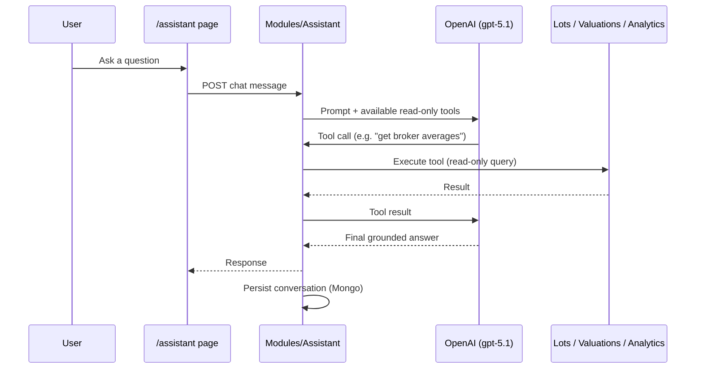

# 08 — AI Assistant

## Purpose
Define what the AI Assistant is for, how it's grounded, and its limits, so it stays a trustworthy, data-grounded tool rather than drifting into unconstrained generation.

## Scope
The `/assistant` route and `Modules/Assistant` backend module. Not the Knowledge Base's document search (see [15_Knowledge_Base.md](15_Knowledge_Base.md)), though the two share the OpenAI dependency and may be surfaced together.

## Responsibilities
- Answer user questions about the active sale's lots, valuations, and (via the Knowledge Base) uploaded documents.
- Stay grounded — every factual claim about data must come from a tool call against real platform data, not model recall.
- Persist conversations so context isn't lost across a session.

## Architecture
`Modules/Assistant` (`api/v1/assistant` — chat, conversations), backed by OpenAI (`gpt-5.1`) with **read-only tool-calling** into the platform's own data. Conversations and messages persist to MongoDB (`conversations`/`conversationMessages`). Requires an `OpenAI:ApiKey` user secret (root README §1b) — the rest of the platform functions without one, but the Assistant does not.

`AssistantController` never calls the LLM directly — it resolves an `IAgent` through `AgentRouter`/`IAgentRegistry` (`Modules/Agents`, see [`Modules/Agents/README.md`](../backend/Asc.Api/Modules/Agents/README.md) for the full routing/registration model) and delegates to it. **Four agents exist today**: `GeneralAgent` (broad, all tools), `AuctionAgent` (auction/sale analysis), `AnalyticsAgent` (13 years of Colombo auction history, Tea Board averages) and a Reports agent (finds saved reports or generates fresh ones) — see the Agents README for each one's tool set. `ChatRequestDto.Agent` selects between them; omitting it preserves the original behavior (always `GeneralAgent`), so every client written before agent selection existed is unaffected.


```mermaid
sequenceDiagram
    participant U as User
    participant FE as /assistant page
    participant API as Modules/Assistant
    participant LLM as OpenAI (gpt-5.1)
    participant Data as Lots / Valuations / Analytics

    U->>FE: Ask a question
    FE->>API: POST chat message
    API->>LLM: Prompt + available read-only tools
    LLM->>API: Tool call (e.g. "get broker averages")
    API->>Data: Execute tool (read-only query)
    Data-->>API: Result
    API->>LLM: Tool result
    LLM-->>API: Final grounded answer
    API-->>FE: Response
    API->>API: Persist conversation (Mongo)
```

## UI behaviour
The page opens on an empty state: four agent cards (selected state shown; hover for the backend description), per-agent suggested prompts, and shortcut links to Valuation Centre, Reports, Broker Comparison, Market Intelligence and Mark Intelligence. Past conversations live in a collapsible history sidebar (grouped by day, searchable). The composer is multiline (Enter sends, Shift+Enter newline), shows which sale is in scope (the Topbar's active sale, also sent with every message), and carries an "AI-generated, check key figures" notice. Replies slower than 20 s show a "still working" hint with a Stop waiting button. The agent per conversation is remembered client-side only (localStorage) because the backend doesn't return it. Provider default: OpenAI when configured, else Local, then Gemini, Groq.

Chat-style interface at `/assistant`; also surfaced in condensed form on the Dashboard via `AiInsightsPanel` ([03_Dashboard_Experience.md](03_Dashboard_Experience.md)). Answers should be clearly attributed as AI-generated, and where a number is stated, it should be traceable back to a tool call result, not presented as unverified prose.

### Custom reports with charts (Reports Agent)
Any breakdown or trend no fixed report covers ("how is off-grade quantity shared among brokers", "broker share over the last 6 sales as a stacked chart") is built on demand by the **Reports Agent** with two read-only tools (`Modules/Agents/CustomReportTools.cs`):
- `query_data` — filters the full all-broker MSL archive (category, grade type, tea type, manufacture, elevation, grade, broker, sold status, sale type, years/sales), groups by one dimension (broker, elevation, grade, category, buyer, mark, factory, price range, sale, sold status), optionally splits across the last N sales, and picks a measure (quantity offered/sold, proceeds, average price, lots). It runs through the same `MslFilteredAnalyticsEngine` as the Analysis screen, so figures match. With no period given it covers only the latest sale and says so. It uses the engine's lightweight mode (no filter-dropdown options or factory names), so the first custom report after a backend restart does not pay the one-off load of every weekly Excel catalogue. The archive ends at the last imported MSL sale, which can trail the latest Excel catalogue (32/2026 vs 38 when this was written), so a sale the archive lacks returns no lots.
- `make_chart` — draws a stored result as bar, horizontal bar, stacked bar, 100% stacked bar, line or pie. Invalid combinations (e.g. a pie of averages) return an error the model can act on.

The model never handles the numbers: `query_data` stores the dataset server-side and returns a markdown table plus an id; `make_chart` returns a `[[chart:id]]` placeholder that the agent expands into a fenced `asc-chart` block after the reply, so the chart persists with the conversation. The frontend (`components/assistant/ChartBlock.tsx`) renders it as plain SVG with hover tooltips, a legend, a table view (Excel/CSV download) and dark mode; brokers use the app's own portal colours (`lib/brokers.ts`). A **Save report** button under any answer containing a chart snapshots it (scope, tables, charts) as a Saved Report of type `custom-chart` via `POST /api/v1/reports/saved`; it reopens in a viewer on the Saved Reports page (`GET /saved/{id}/content`) and is a point-in-time snapshot, not regenerated. Saving is a deliberate user click — the assistant itself never writes, preserving the read-only rule — and, like every saved report, is visible to all signed-in users. Snapshots are capped at 200,000 characters and excluded from list queries. Each chart also has a PNG download, and the viewer's **Print / PDF** button opens `/print/custom-report?id=…` (a chrome-free print route, same pattern as `print/market-bulletin`) that hands the report to the browser's Save as PDF — charts are kept whole across page breaks and the on-screen buttons are hidden. Reliable use needs a strong tool-calling model — the local Llama 3.2 3B is not one.

## Business rules
- **Read-only.** The Assistant's tools query data; they must never mutate a valuation, lot, or any other record. Any "do this for me" request that implies a write should route the user to the relevant module (Valuation Centre, Reports) rather than being executed by the Assistant directly.
- **Grounded, not generative.** Numeric or factual claims about the current sale must originate from a tool call, not from the model's own generation — this is the core trust property of the feature (see [00_Project_Vision.md](00_Project_Vision.md), "Grounded AI, not generative guessing").
- Once [07_Metrics_Registry.md](07_Metrics_Registry.md) exists, the Assistant's tools should call registry metrics by identifier, guaranteeing its answers match the dashboard/reports exactly.

## Dependencies
[06_Shared_Analytics_Engine.md](06_Shared_Analytics_Engine.md), [07_Metrics_Registry.md](07_Metrics_Registry.md), [15_Knowledge_Base.md](15_Knowledge_Base.md) (shared OpenAI dependency), [18_Security.md](18_Security.md) (API key handling, auth on the assistant endpoints).

## Future expansion
Suggested-question prompts based on current sale state; proactive insights surfaced without being asked (partially begun via `AiInsightsPanel`); write-capable "confirm and apply" flows (e.g. Assistant drafts a bulk classification for user confirmation) — would need careful scoping to preserve the read-only trust boundary.

## Implementation notes
Backend: `backend/Asc.Api/Modules/Assistant`. Frontend: `frontend/src/app/(app)/assistant/`. Requires `OpenAI:ApiKey` (dotnet user-secret, never in `appsettings.json`).

### Local model for development/testing
A fourth provider, `local` ("Local (Ollama)", `LocalChatProvider`), talks to any server exposing the OpenAI `/chat/completions` contract — no API key, no network egress, no per-token cost. It is opt-in: it only lists as configured once `Local:Model` is set, so it never shows as an option in an environment that hasn't chosen it.

Setup with Ollama:

```bash
ollama pull llama3.1          # any tool-calling-capable model (llama3.1/3.2, qwen2.5, …)
dotnet user-secrets set Local:Model "llama3.1"   # in backend/Asc.Api
```

Ollama's default URL (`http://localhost:11434/v1/chat/completions`) is assumed; override with `Local:BaseUrl` for LM Studio/vLLM/llama.cpp. The picked model must support tool calling or every answer comes back tool-blind. Local requests get a 10-minute HTTP timeout (CPU inference is slow); failures surface as the gateway's normal provider error, never a silent fallback to a hosted vendor. Embeddings (Knowledge Base) still use OpenAI — this provider covers chat only.

## Open questions
- Replies don't yet show which tool calls/sources backed a number (the traceability requirement above) — needs the backend to return tool-call metadata with each reply.
- Custom-report charts are not yet included in PDF/PPTX exports (each chart can be downloaded as PNG).
- An "Auto" agent (routing via `AgentRouter` so users needn't pick) and streamed replies with tool progress are not built.
- Tool surface (which read-only queries the Assistant can call) isn't formally documented anywhere — should be enumerated here once stable.
- Conversation retention policy (how long conversations are kept, whether they're per-user-private) isn't specified.

## Best practices
- Never add a write-capable tool to the Assistant without an explicit user-confirmation step and a security review ([18_Security.md](18_Security.md)).
- When the Assistant needs a new kind of data access, prefer exposing it as a new metrics-registry entry / analytics-engine query over a bespoke Assistant-only query path.
